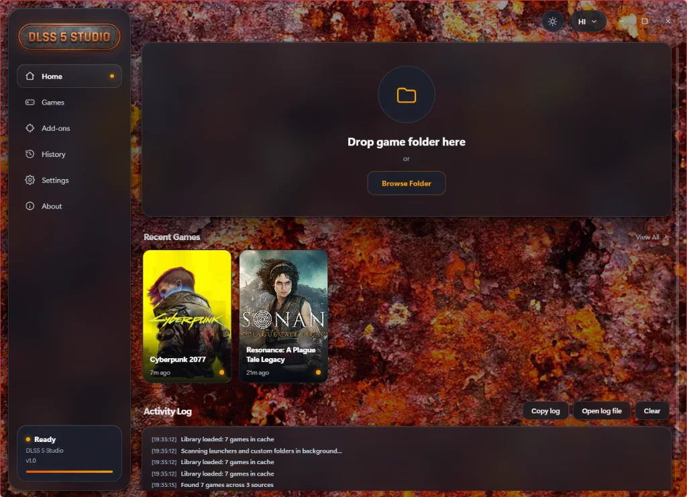
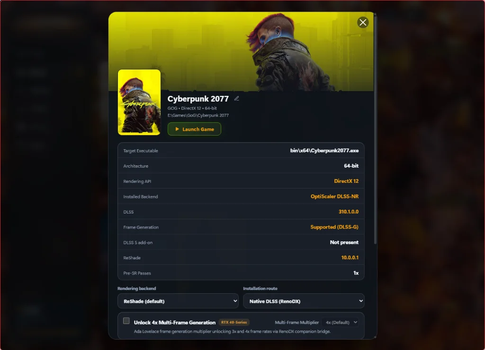
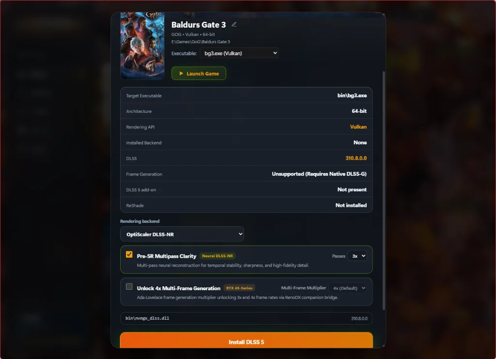
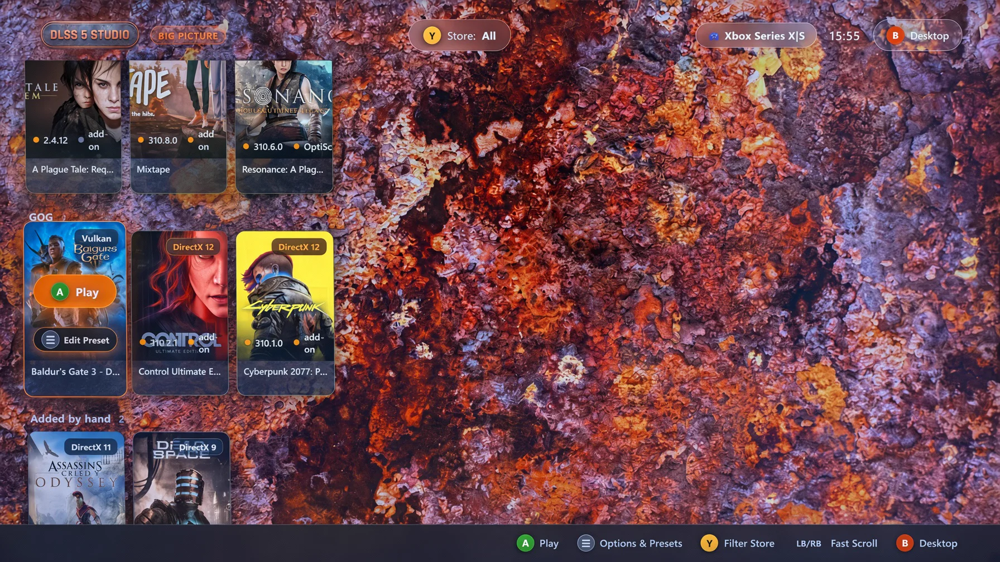
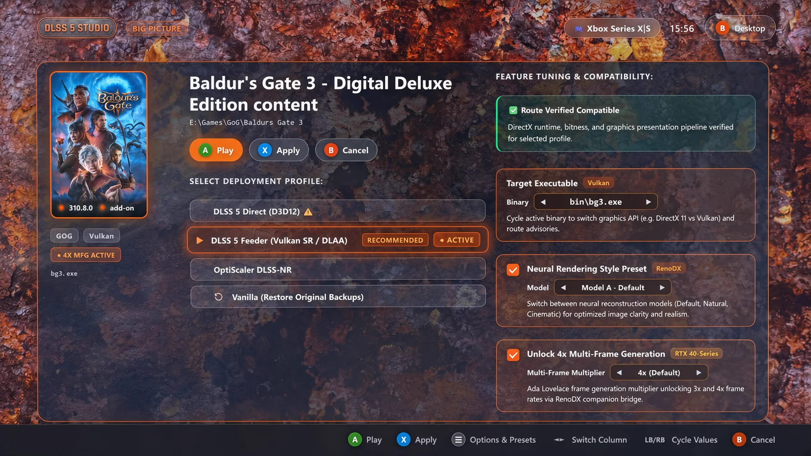
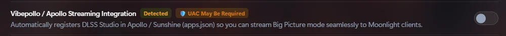
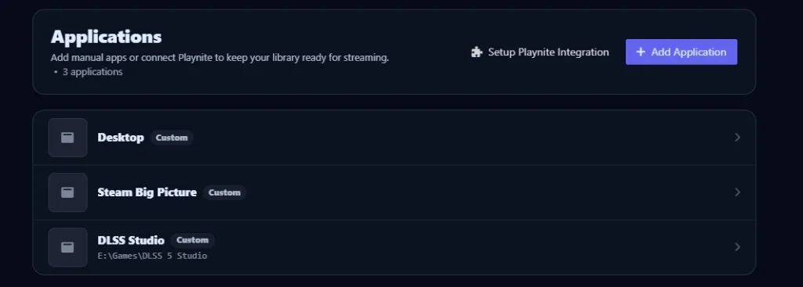

# DLSS 5 STUDIO ⚡ v2.0.1

> **A blisteringly fast, low-memory utility built in pure native Rust to enable and unlock DLSS, Neural Reconstruction, and 4x Frame Generation across your PC games while preserving pristine graphical fidelity.**
>
> _Supports all **GeForce RTX GPUs (20, 30, and 40-Series)** for DLSS upscaling and OptiScaler Pre-SR, with **exclusive 4x Multi-Frame Generation unlocking for RTX 40-Series cards**._

[-blue.svg>)](#)

**DLSS 5 STUDIO** is a ground-up pure Rust desktop utility engineered for extreme speed and minimal resource usage. It enables gamers to inject and upgrade modern DLSS features, Neural Reconstruction, and OptiScaler Pre-SR across their game libraries—with **3x/4x Multi-Frame Generation unlocked specifically for GeForce RTX 40-Series GPUs**.

Built with [Dioxus](https://dioxuslabs.com/) and direct Win32 APIs, it eliminates heavy web-wrapper and Electron stacks—launching in under 200ms and consuming under 20 MB of RAM.

  

---

## 🌟 Key Features

### 1. ⚡ 4x Multi-Frame Generation (MFG) Unlock

- **Bypass RTX 50-Series Driver Locks**: NVIDIA officially restricts 3x and 4x Multi-Frame Generation in drivers to RTX 50-Series hardware. DLSS 5 STUDIO unlocks 3x and 4x multipliers on GeForce RTX 40-Series GPUs.
- **Native DLSS-G Interception**: Leverages RenoDX hook add-ons (`renodx-mfgunlock.addon64`) to intercept Streamline Frame Generation contracts on games with native Frame Generation code (`sl.dlss_g.dll`, `nvngx_dlssg.dll`).
- **Honest Hardware & API Gating**: Automatically detects whether a game's engine has native Frame Generation or only DLSS Super Resolution (e.g. _Baldur's Gate 3_), and strictly gates MFG availability on DirectX 11 executables (`bg3_dx11.exe`) where Streamline Frame Generation is unsupported.

  

### 2. 🔬 OptiScaler DLSS-NR & Pre-SR Multipass

- **OptiScaler Neural Reconstruction Pipeline**: Route graphics through OptiScaler's open-source multi-vendor wrapper (`nvngx.dll` / `dxgi.dll`).
- **Pre-SR Multipass Clarity**: Enables multi-pass neural reconstruction (`1x`, `2x`, or `3x` passes) for dramatic clarity, sharpness, and temporal stability enhancements.
- **Universal RTXMFG Integration**: Pairs OptiScaler with standalone proxy hooks (`version.dll`) to allow simultaneous Frame Generation and Pre-SR multipass enhancements in supported 64-bit games.

  

### 3. 🎮 10-Foot Big Picture Mode & Moonlight / Apollo Couch Streaming (v2.0)

DLSS Studio v2.0 introduces an ultra-responsive, console-grade **10-Foot Big Picture Mode** built from the ground up for living room 4K HDR TVs, handheld devices, and Moonlight remote game streaming:

- **Native XInput Gamepad Navigation**: Pure Rust sub-millisecond controller polling with instant layout feedback for Xbox, PlayStation, and Moonlight virtual gamepads. Features quick store switching (`LB`/`RB`), fluid card selection, and tactile controller glyph hints.
- **Deep Game Inspector & Tuning Modal**: Inspect games directly from your couch. Features one-click **Apply & Play**, separate **Patch** and **Play** actions, dynamic binary executable cycling (`bg3.exe` vs `bg3_dx11.exe`), real-time route advisory warnings, and on-the-fly preset tuning (Pre-SR Multipass, Neural Rendering Style, 4x Multi-Frame Generation).
- **Vibepollo / Apollo / Sunshine Streaming Integration**: Automatically discovers local Sunshine and Apollo host configurations. A single toggle in Settings registers DLSS Studio Big Picture Mode (`--big-picture`) directly into `apps.json` with embedded box art, enabling zero-config streaming launches straight from Moonlight clients.

  

  

#### 📺 Vibepollo & Apollo / Sunshine Streaming Integration

Stream DLSS Studio Big Picture mode seamlessly to any Moonlight client (handhelds, Apple TV, Smart TVs, Android/iOS) with automatic host registration:

  

  

### 4. 🎯 Flexible Rendering Backends & Routes

- **ReShade Backend**:
  - **`Native DLSS (RenoDX)`**: For DirectX 12 games with native DLSS pipelines. Hooks into D3D12 NGX vtables and enables 4x MFG unlock.
  - **`DLSS 5 Feeder`**: Dedicated frame interception route for non-DLSS titles or games running on DirectX 11, Vulkan, OpenGL, or legacy pre-DirectX 10 APIs (DirectX 8 and DirectX 9 via automated dgVoodoo 2 translation with 32-bit LAA memory support) (`dlss5-feed.addon64`, `DLSS5_Feed.fx`, `vort_Motion.fx`).
- **OptiScaler Backend**:
  - **`OptiScaler DLSS-NR`**: Full neural reconstruction with Pre-SR multipass. Automatically restricted on titles lacking native depth and motion vectors.
- **Seamless Cross-Route Hot-Swapping**: Switch freely between ReShade (Native/Feeder) and OptiScaler with a single click. DLSS 5 STUDIO automatically unregisters Vulkan implicit layers, removes conflicting proxy DLLs, and deploys the new payload while carrying forward the original vanilla game backups.

### 5. 🚀 Universal Multi-Store Game Scanner

Scans and organizes your games automatically without manual configuration:

- **Steam**: Resolves library roots from `SteamPath` registry and `libraryfolders.vdf`, parses `appmanifest_<id>.acf`, and downloads official 600x900 vertical box art from Steam CDN.
- **Xbox Game Pass / Microsoft Store**: Queries `GamingServices` package repository and scans `XboxGames` drive roots. Parses GDK `MicrosoftGame.config` and `AppxManifest.xml` to bypass launcher wrappers (`gamelaunchhelper.exe`), resolves authentic 64-bit executables, and extracts high-resolution logos directly from package assets.
- **Epic Games Store**: Discovers installed titles by parsing `%PROGRAMDATA%\Epic\...\Manifests\*.item` manifests.
- **GOG Galaxy**: Inspects `GOG.com\Games` registry trees and `goggame-*.info` playtasks.
- **Custom Folders & Manual Executables**: Add any custom game folder or executable with instant automatic Steam CDN box art resolution, smart nested directory climbing (e.g. `bin/x64` auto-resolving to the authentic parent title), fuzzy title boundary splitting, on-demand artwork refresh, and persistent caching.

### 6. 🛡️ Bulletproof Backup, Rollback & Process Safety

- **Atomic Rollback Journals**: Every modification automatically creates a snapshot in `_DLSS5_Backup/originals/` before touching any game files.
- **Vanilla Backup Continuity**: Switching between routes carries forward the genuine unmodded game files through arbitrary successive swaps.
- **Restore Originals**: Restores authentic vanilla binaries with a single click and archives the backup manifest.
- **Clean Untracked Mods**: Purges leftover proxy DLLs (`dxgi.dll`, `OptiScaler.dll`, `ReShade64.dll`, `.addon64`) up to 4 directory levels deep without risking original game files.
- **Process Guarding**: Inspects running processes via native Win32 `Toolhelp32` snapshots, blocking mod deployment or restoration if the game is running.
- **Anti-Cheat Detection**: Detects EasyAntiCheat, BattlEye, and Vanguard, warning you before touching protected titles.

### 7. 🌍 Complete Multilingual Localization (14 Languages)

- **14 Supported Languages**: English, Deutsch (German), Español (Spanish), Français (French), Italiano (Italian), Português (Portuguese), Русский (Russian), 简体中文 (Simplified Chinese), 日本語 (Japanese), 한국어 (Korean), Polski (Polish), Türkçe (Turkish), العربية (Arabic with full RTL layout support), and हिन्दी (Hindi).
- **Reactive Dynamic Switching**: Instantly switch languages anytime from the header selector or Settings. All views, sheets, specs, action badges, and tooltips update in real-time with zero app restart.
- **Structured Activity Logging Engine**: Activity log entries use tokenized templates (`@{key|...}`), allowing the in-app terminal to dynamically translate logs into the selected language while keeping on-disk diagnostics (`dlss-studio.log`) in standard English for seamless GitHub issue reporting.
- **Localized History & Tooltips**: Fully translated modification history tables, dynamic change counts (`0 replaced, 5 added`), action badges, and localized play button tooltips (`Launch {game}`).

### 8. 🪶 100% Pure Rust Performance

| Metric                   | Traditional Web / Electron Apps | **DLSS 5 STUDIO**            | Advantage                      |
| :----------------------- | :------------------------------ | :--------------------------- | :----------------------------- |
| **Idle Memory (RAM)**    | 350 MB – 600 MB                 | **~20 MB**                   | **95% less RAM**               |
| **Executable Size**      | 120 MB – 250 MB                 | **7.0 MB**                   | **96% smaller**                |
| **Startup Time**         | 2.5s – 6.0s                     | **< 200ms**                  | **Instantaneous**              |
| **Window Dragging**      | Emulated / CSS Drag Regions     | **Native Win32 `HTCAPTION`** | Fluid Tao window management    |
| **Runtime Dependencies** | Node.js, Chromium, PowerShell   | **None (Pure Win32)**        | Standalone portable executable |

---

## 💻 System Requirements

- **Operating System**: Windows 10 (1903+) or Windows 11 (64-bit)
- **Graphics Card**:
  - Any DirectX 11, DirectX 12, or Vulkan compatible GPU.
  - _For DLSS Super Resolution_: NVIDIA GeForce RTX 20/30/40/50-Series.
  - _For 4x Multi-Frame Generation Unlock_: NVIDIA GeForce RTX 40-Series (Ada Lovelace) GPU.
- **Storage**: ~15 MB free space (base).

---

## 📦 Installation & Download

### Standalone Setup / Installer (Recommended)

- Run **`dlss-studio-v<version>-setup.exe`** for standard Windows installation with Start Menu and Desktop shortcuts.
- **Seamless In-Place Updates**: Automatically detects previous installations, displaying an **"Update"** flow that safely terminates running application instances before copying files, while preserving all user libraries, settings, and custom folders.

### Portable Executable

1. Download **`dlss-studio-v<version>-portable.exe`** from the [Releases](https://github.com/bookamp/dlss-studio/releases) page.
2. Run from anywhere—no installation required.

---

## 🛠️ How to Use

1. **Launch DLSS 5 STUDIO**: Your installed games across Steam, Xbox Game Pass, Epic Games, and GOG will populate automatically.
2. **Desktop Mode**: Click on any game card to open its detail sheet, choose your rendering backend and preset options, and click **"Install DLSS 5"**.
3. **10-Foot Big Picture Mode**:
   - Click the **TV icon** in the top navigation bar or launch via the CLI using `dlss-studio.exe --big-picture`.
   - Alternatively, launch directly from your TV or couch via **Moonlight** using the Apollo / Sunshine integration!
   - Use any Xbox, PlayStation, or virtual controller to browse games, tune routes, cycle executables, and launch your titles with a single button press.
4. **Revert or Restore**: Click **"Restore originals"** (or use the gamepad `CLEAN` option) at any time to return game files to their unmodded state.

---

## 📚 Acknowledgements & Third-Party Components

- **DLSS 5 Swapper**: Original UI layout, visual design, and desktop concept ([rakanki911/DLSS5-Swapper](https://github.com/rakanki911/DLSS5-Swapper)).
- **dgVoodoo 2**: Legacy DirectX 1–9 to Direct3D 11/12 graphics wrapper by **Dege** ([dege-diosg/dgVoodoo2](https://github.com/dege-diosg/dgVoodoo2)).
- **DLSS 5 Feeder**: Universal ReShade frame interception pipeline for non-DLSS and non-DX12 titles by **jlrouzies-fr** ([jlrouzies-fr/DLSS5-Feeder](https://github.com/jlrouzies-fr/DLSS5-Feeder)).
- **MFGAdaUnlock-RenoDx**: Streamline Frame Generation 4x unlocker add-on for GeForce RTX 40-Series GPUs by **mavismmg** ([mavismmg/MFGAdaUnlock-RenoDx](https://github.com/mavismmg/MFGAdaUnlock-RenoDx)).
- **vort_Shaders & vort_Motion**: Temporal optical flow and motion vector calculation shaders by **vortigern11** ([vortigern11/vort_Shaders](https://github.com/vortigern11/vort_Shaders)).
- **OptiScaler DLSS-NR & Pre-SR**: Specialized neural reconstruction & multi-pass wrapper developed by **wilsjo2** ([OptiScaler-DLSSNR-PreSR-Multipass](https://github.com/wilsjo2/OptiScaler-DLSSNR-PreSR-Multipass)), based on upstream [OptiScaler](https://github.com/optiscaler/OptiScaler) by **cdozdil** (Nitec).
- **RenoDX & Frame Generation Mods**: HDR pipeline, Streamline contract hooking, and frame interception runtimes developed by **Otis_Inf**, **ShortFuse**, and the **RenoDX** project team.
- **ReShade**: Advanced generic post-processing injector, swapchain hook, and native C++ Add-on framework by **crosire** ([crosire/reshade](https://github.com/crosire/reshade) and [crosire/reshade-shaders](https://github.com/crosire/reshade-shaders)).
- **NVIDIA Streamline**: Cross-vendor open-source interposer framework for DLSS and Frame Generation ([NVIDIA/Streamline](https://github.com/NVIDIA/Streamline)).
- **Rust Ecosystem**: Built using [Dioxus](https://dioxuslabs.com/), [mimalloc](https://github.com/microsoft/mimalloc), [pelite](https://github.com/CasualX/pelite), [winres](https://github.com/mxre/winres), and native Win32 APIs.

---

## 📜 License

This project is licensed under the MIT License. See [LICENSE](https://github.com/bookamp/dlss-studio/blob/main/LICENSE) for details.
